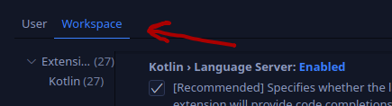

# Project workflow

## Conventional commits

We love and therefore use [Conventional Commits](https://www.conventionalcommits.org/en/v1.0.0/).

Conventional commits requires next commit types:
- `feat`
- `fix`


Additionally we introduce the next ones:
- `refactor` - for changes, which heavily modifies the code with the sole goal to simplify the code. The change MUST NOT introduce any new features, but MAY introduce fixes occasionally.
- `chore` - for small changes, such as variable/file renaming, changes to comments, import organisation, formatting

## Feature based workflow

We use feature based workflow, which implies branch per feature/bug/issue

## Tracking issues

If you want to introduce massive change, please create a corresponding tracking issue and pull-request.

## Project-wise requirements

> These requirements apply to the project as a whole.

KLSP:
- *MUST NOT* create any system files in user's project folder, and user's home folder.
- *SHOULD NOT* rely on editor specific features


# Development

## New to Kotlin?

Check out these links:
- [Kotlin Function features](https://kotlinlang.org/docs/functions.html)
- [infix notation](https://kotlinlang.org/docs/functions.html#infix-notation)
- [Kotlin lambdas](https://kotlinlang.org/docs/lambdas.html)
- [Scope functions](https://kotlinlang.org/docs/scope-functions.html)

While working with kotlin, you are likely to encounter concepts from the above list

## How to Setup Custom Kotlin Language Server

> Custom version of `vscode-kotlin` required

While working on this project, it may be useful to try it out right away! Luckily for us, `vscode-kotlin` extension supports custom versions for kotlin-language-server.

Check out [kotlin.languageServer.path](vscode://settings/kotlin.languageServer.path) in vscode settings (if link does not work, use above setting id to search for it). The setting requires a path to `kotlin-language-server` bash script. The script is auto generated by Gradle. The script is useless by itself and requires full `kotlin-language-server` installation to be present. To make such installation from sources, run:
```
gradlew installDist
```

> The command generates unpacked ready to be used `kotlin-language-server` installation.

> Installation consists of all required dependencies, the server itself and the script

Set [kotlin.languageServer.path](vscode://settings/kotlin.languageServer.path) to `<workspaceRoot>/server./server/build/install/server/bin/kotlin-language-server`. Replace `<workspaceRoot>` with the actual path tp `kotlin-language-server` repository on your local filesystem.

## Launch Kotlin Language Server in Debug mode

> **⚠️ All setting mentioned in this section should be set for *WORKSPACE* profile only!**



Kotlin language server supports debugging in next [connection modes](vscode://settings/kotlin.languageServer.transport):
 - `tcp-attach`
 - `stdio`

### STDIO Connection

In `stdio` mode `vscode-kotlin` extension completely manages server lifecycle. That is you can't manually restart on completely stop the server. To restart the server do the following: `Ctrl + Shift + P` to open vscode command prompt -> `Developer: Reload Window`. This will reload window and restart extension host, so the kotlin server would be restarted too.

Then activate these settings:
- [kotlin.languageServer.debugAttach.enabled](vscode://settings/kotlin.languageServer.debugAttach.enabled)
- [kotlin.languageServer.debugAttach.autoSuspend](vscode://settings/kotlin.languageServer.debugAttach.autoSuspend)

### TCP Attach

On the other hand, `tcp-attach` mode allows *you* to manage lifecycle of the server. `vscode-kotlin` automatically connect/reconnects to the server when server becomes available. When server is killed, extension automatically disconnects and waits for new instance of the server.

In this mode, you manage the server. To start it, use the next command from the root of `kotlin-language-server` workspace:

```
./server/build/install/server/bin/kotlin-language-server --tcpClientPort 7721
```

This launches the server in `TCP Client` mode. The server will connect to the specified `tcpClientPort`.

Default port is `7721`

#### Implementation details

`vscode-kotlin` launches tcp server to accept new connections. Once `vscode-languageclient` requests new connection, `vscode-kotlin` starts to listen for new connections on the [kotlin.languageServer.port](vscode://settings/kotlin.languageServer.port). When single connection is accepted, `vscode-kotlin` stops to listen for new connections. Once connections is closed and `vscode-languageclient` requests new connection, `vscode-kotlin` starts to listen for connections again.
