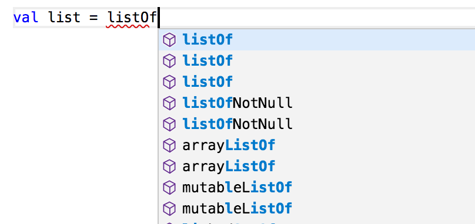
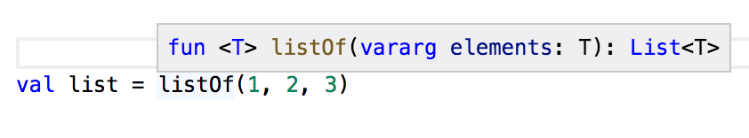
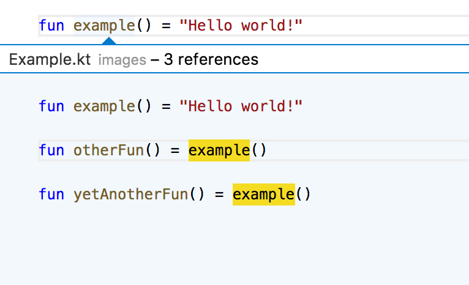
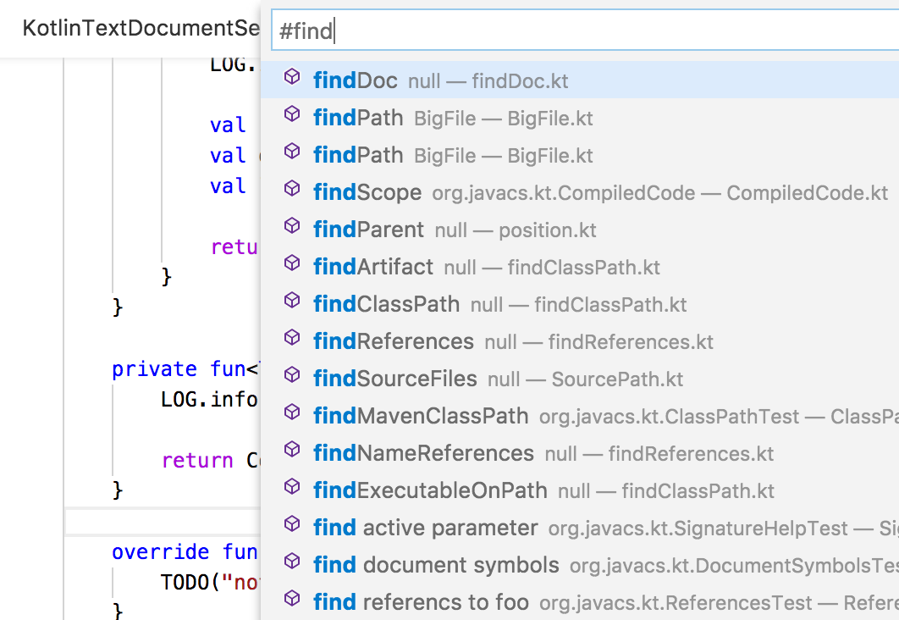

# KotlinLanguageServer
A [language server](https://microsoft.github.io/language-server-protocol/) featuring smart code completion, diagnostics, hover, document symbols, method signature help and more for Kotlin and a VSCode extension that uses the language server.

## Getting Started
* See [BUILDING.md](BUILDING.md) for build instructions.
* See [Roadmap](https://github.com/fwcd/KotlinLanguageServer/projects/1) for features, planned additions, bugfixes and changes
* See [KotlinQuickStart](https://github.com/fwcd/KotlinQuickStart) for a sample project

## This repository needs your help!
[The original author](https://github.com/georgewfraser) created this project while he was considering using Kotlin in his work. He ended up deciding not to and is not really using Kotlin these days though this is a pretty fully-functional language server that just needs someone to use it every day for a while and iron out the last few pesky bugs.

There are two hard parts of implementing a language server:
- Figuring out the dependencies
- Incrementally re-compiling as the user types

The project uses the internal APIs of the [Kotlin compiler](https://github.com/JetBrains/kotlin/tree/master/compiler).

Dependencies are determined by the [findClassPath](src/main/kotlin/org/javacs/kt/classpath/findClassPath.kt) function, which invokes Maven or Gradle and tells it to output a list of dependencies. Currently, both Maven and Gradle projects are supported.

I get incremental compilation at the file-level by keeping the same `KotlinCoreEnvironment` alive between compilations in [Compiler.kt](src/main/kotlin/org/javacs/kt/Compiler.kt). There is a performance benchmark in [OneFilePerformance.kt](src/test/kotlin/org/javacs/kt/OneFilePerformance.kt) that verifies this works.

Getting incremental compilation at the expression level is a bit more complicated:
- Fully compile a file and store in [CompiledFile](src/main/kotlin/org/javacs/kt/CompiledFile.kt):
    - `val content: String` A snapshot of the source code
    - `val parse: KtFile` The parsed AST
    - `val compile: BindingContext` Additional information about the AST from typechecking
- After the user edits the file:
    - Find the smallest section the encompasses all the user changes
    - Get the `LexicalScope` encompassing this region from the `BindingContext` that was generated by the full-compile
    - Create a fake, in-memory .kt file with just the expression we want to re-compile
        - [Add space](src/main/kotlin/org/javacs/kt/CompiledFile.kt#L81) at the top of the file so the line numbers match up
    - Re-compile this tiny fake file

The incremental expression compilation logic is all in [CompiledFile.kt](src/main/kotlin/org/javacs/kt/CompiledFile.kt). The Kotlin AST has a built-in repair API, which seems to be how IntelliJ works, but as far as I can tell this API does not work if the surrounding IntelliJ machinery is not present. Hence I created the "fake tiny file" incremental-compilation mechanism, which seems to be quite fast and predictable.

There is an extensive suite of behavioral [tests](src/test/kotlin/org/javacs/kt), which are all implemented in terms of the language server protocol, so you should be able to refactor the code any way you like and the tests should still work.

## Features

### Autocomplete

### Signature help

### Hover

### Go-to-definition, find all references

### Document symbols

### Global symbols

## Authors
* [georgewfraser](https://github.com/georgewfraser)
* [fwcd](https://github.com/fwcd)
